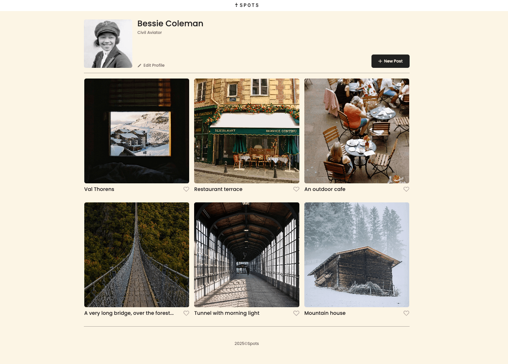
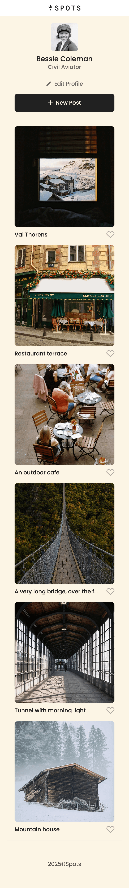

# Project 5: Spots

Responsive design from desktop to mobile.
Added JavaScript modal functionality with smooth CSS transitions.
Add and change profile name and title.
Create new post URL and caption.
Value logged to the conosle.
Created functions to add and remove classes that are more reusable.
Add and delete photos via JavaScript, open modal for specified images.

### Overview

- Intro
- Figma
- Images

**Intro**

This project is made so all the elements are displayed correctly on popular screen sizes using Flexbox, Grid, Media queries and JavaScript.
Spots is an interactive image-sharing application. Users can add and remove photos, like photos from other users, and make minor adjustments to their profile.

**Figma**

- [Link to the project on Figma](https://www.figma.com/file/BBNm2bC3lj8QQMHlnqRsga/Sprint-3-Project-%E2%80%94-Spots?type=design&node-id=2%3A60&mode=design&t=afgNFybdorZO6cQo-1)

Spots Project URL:
https://brandonwirz.github.io/se_project_spots/

